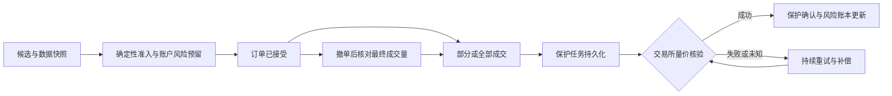

# NOFX 前后端深度审查 · 2026-10-01

审查版本：`8bff6ef1`。范围为全库架构扫描，以及候选池 → 行情/信号 → AI 决策 → 执行风控 → 挂单/成交 → 保护单 → 重启恢复 → 复盘/调参的重点深入检查；同时核查 React 页面、API 权限与交易所适配差异。不是对每个文件逐行完成形式化验证。

**主要结论：现有方案已有较完整的信号与风控设计，但“决策准入”和“成交后保护确认”尚未形成可靠闭环。最值得优先投入的是执行可靠性与状态一致性。继续增加指标、Prompt 条款或自动调参，会放大当前执行层缺口。**

发现中有 11 项通过隔离回归测试直接复现，包含 4 个不同禁开码子场景。页面另复现了语言切换覆盖自定义 Prompt、测试模型切换丢失草稿，以及移动端风险信息缺失。其余发现有明确静态代码路径，文中单独标明。没有连接真实交易账户、发送真实订单或更改生产策略。

## 1. 优先级与修复顺序

P1：可导致保护缺失、准入绕过、敏感数据泄露或运行交易状态错误；P2：功能正确性、迭代有效性或交易体验问题；P3：性能与维护性。

| 优先级 | 发现 | 建议安排 |
|---|---|---|
| P1 | F01 保护单失败仍报告成功；F02 先撤旧止损再挂新止损 | 第一批：保护确认、失败补偿、持久化重试 |
| P1 | F03 禁开码未统一执行；F04 池外标的可穿过准入；F05 限价单绕过复盘规则 | 第一批：唯一的执行准入入口 |
| P1 | F06 成交保护依赖 AI 周期、停止后留有入场单；F07 恢复链路不完整 | 第一批：独立订单/保护服务 |
| P1 | F08 重载清空日亏损锚点；F09 公开策略泄露配置凭据 | 第一批：持久化熔断、公开配置脱敏 |
| P1，条件触发 | F10 跨交易所行情不一致；F11 同账户多交易器风险预留不共享 | 第二批：交易场所一致性、账户级风险管理 |
| P1，网格策略 | F12 网格降级适配器伪造入场成功；F13 网格成交和数量账本失真 | 网格上线/扩展前处理 |
| P2 | F14 网格回撤/PnL 口径；F15 调参验证；F16 编辑器覆盖草稿 | 第二批：参数版本、编辑保存行为 |
| P2 | F17 旧数据显示为在线；F18 移动端隐藏关键价位；F19 OI 豁免失效；F20 候选池过期；F21 成交后 RR/结构验证 | 第三批：选币一致性、风险可见性 |

建议先修复第一批，再评估小规模受控运行与调参实验；不能以现有测试全绿作为自动交易链路已经可靠的证据。

## 2. 关键发现与证据

### F01 · P1 · SL/TP 未完整成功，交易状态却提前推进

**触发**：开仓成交后，交易所拒绝止损或止盈；或下单接口返回成功但保护单未真正生效。

市价开仓调用 `placeProtectiveOrders` 后不检查返回值，仍返回成功：[市价多单路径](/Users/zhangyun/workspace/nofx/trader/auto_trader_orders.go:300)。保护函数只返回 SL 错误；TP 拒绝只写日志，后续核验也只告警、不影响返回值：[TP 与返回值](/Users/zhangyun/workspace/nofx/trader/auto_trader_orders.go:587)、[核验函数](/Users/zhangyun/workspace/nofx/trader/auto_trader_orders.go:622)。

限价路径的 `protectExecutedSlice` 据此推进 `ProtectedQty`；全成交分支又无条件删除 pending 记录，并通知“保护单已挂”：[水位推进](/Users/zhangyun/workspace/nofx/trader/auto_trader_pending.go:668)、[全成交处理](/Users/zhangyun/workspace/nofx/trader/auto_trader_pending.go:456)。因此 SL 失败后恢复计划丢失，TP 失败后该成交量被错误标记为已保护。当前 watchdog 可能在后续周期补救 SL，但不能保证立即恢复。

此外，分批 TP 在实际挂单前就设置 runner 标志；失败后 watchdog 的 `!tpRunnerDone` 条件会跳过补挂：[标志写入](/Users/zhangyun/workspace/nofx/trader/auto_trader_orders.go:578)、[补挂条件](/Users/zhangyun/workspace/nofx/trader/auto_trader_risk.go:1605)。TP 补挂仍传数量 `0`，与需要有效数量的适配器不一致：[补挂数量](/Users/zhangyun/workspace/nofx/trader/auto_trader_risk.go:1611)。

**复现**：模拟 TP 拒绝，`ProtectedQty` 仍变为 1；模拟全成交后 SL 拒绝，pending 仍被删除。两项专项测试均捕获缺口。

**建议**：返回 SL、TP 各自的订单 ID、实际价格、覆盖量和核验状态；只有核验成功的腿推进其水位。将成交记录与保护任务分开持久化，保护失败进入重试队列，达到时限后执行预先定义的补偿策略。失败提示必须显示具体缺失腿，禁止记录为成功。

### F02 · P1 · 替换止损失败会撤掉原有保护

`moveStopExchange` 读取数量后先撤旧 SL，忽略撤单错误，然后直接下新 SL；新单拒绝没有恢复原单：[替换逻辑](/Users/zhangyun/workspace/nofx/trader/auto_trader_vol.go:81)。该函数被保本、移动止损和 AI 调整共同使用。支持方向撤单的适配器之外，还会回退到整个 symbol 撤 SL，同币双向持仓会相互影响。

**复现**：模拟新 SL 拒绝，旧 SL 已被撤销。

**建议**：优先使用交易所原生改单；否则建立带失败补偿的替换流程。交易所支持同时存在时，先挂新单并核验再撤旧单；不支持时保留原订单参数，失败必须恢复并核验。撤单按账户、symbol、方向和明确订单 ID 操作。

### F03 · P1 · 多个“硬门”只进入提示词，没有统一执行

信号层会生成 `EXTENDED_PUMP_UNCONFIRMED`、`DATA_INSUFFICIENT`、`POOR_HISTORY`、`NEG_EDGE_*` 等方向禁开码：[禁开码生成](/Users/zhangyun/workspace/nofx/kernel/signal_layer.go:1567)。但执行层对 `GateState.Failed` 的直接扫描只专门拦截 `VENDOR_DIVERGENCE*`：[执行检查](/Users/zhangyun/workspace/nofx/trader/auto_trader_risk.go:2140)。其他独立风险检查存在，仍不能覆盖所有方向禁开结论。

**复现**：在参数、仓位和价位几何均可通过的情况下，分别设置上述四种禁开码与 `LongAllowed=false`，`open_long_limit` 均保留。模型不遵循 Prompt 时，该层没有拒绝。

**建议**：把禁开码分成绝对禁止和允许显式例外两类，由一个执行函数统一裁决，市价、限价、改单和 fallback 全部调用。不能简单以“所有 Allowed=false 均禁止”修复，因为部分限价/市价例外原本有不同准入语义；应明确且测试每个码的例外契约。

### F04 · P1 · 候选池、排除列表与实际下单之间缺少最终授权校验

模型可以给出候选池之外的有效交易所 symbol。锚点矫正遇到不存在的 anchor 直接跳过：[锚点缺失路径](/Users/zhangyun/workspace/nofx/kernel/engine_position.go:36)。执行风险门遇到不存在的 gate state，也不会统一拒绝限价开仓；市价的缺失 gate 拒绝只在 `LimitEntryEnabled=true` 时生效：[市价模式条件](/Users/zhangyun/workspace/nofx/trader/auto_trader_orders.go:104)。

**复现**：候选池只有 `XUSDT`，另一标的的限价开仓没有 gate state，仍穿过 `applyHardRiskGates`。完整执行还会检查交易所能否交易该标的，但这不是策略候选池授权校验。

**建议**：执行前验证规范化 symbol 属于本周期允许开仓集合、未被显式排除、属于当前交易所可交易合约，且具有完整且有效的方向 gate。持仓管理动作使用独立授权集合，避免误伤已有仓位的平仓与保护。

### F05 · P1 · 复盘形成的 hard rules 对限价开仓失效

`preTradeRuleCheck` 只检查 `open_long/open_short`，直接放过 `open_long_limit/open_short_limit`：[动作过滤](/Users/zhangyun/workspace/nofx/trader/auto_trader_rules.go:32)。在主要使用限价入场的策略中，复盘 → 规则 → 执行的反馈闭环因此断开。

**复现**：启用“杠杆 > 1 禁止”规则，同为 3 倍杠杆，市价多单被拦截，限价多单未拦截。

**建议**：按“开仓动作类型”统一匹配规则；检查显式限价、市场降级限价、限价转市价等最终执行动作。规则加载失败应根据明确策略停止新增风险，而非无条件跳过检查。

### F06 · P1 · 限价成交保护依赖慢周期，停止后入场单仍可成交

限价成交查询和保护 watchdog 只在 AI 决策周期调用：[周期入口](/Users/zhangyun/workspace/nofx/trader/auto_trader_loop.go:37)。配置以分钟为单位，因此成交后至保护的延迟可能达到一个周期，网络或决策循环耗时还会延长窗口。订单同步入库不能替代挂 SL/TP。

`Stop()` 停止运行与同步后没有清理尚未成交的入场单：[停止流程](/Users/zhangyun/workspace/nofx/trader/auto_trader.go:620)。交易器暂停后 GTC 入场单仍可能成交，此时上述保护流程也已停止。`cancelPending` 撤单成功后直接丢弃状态，未二次核对撤单期间新增的成交量：[撤单路径](/Users/zhangyun/workspace/nofx/trader/auto_trader_pending.go:570)。

**证据类型**：静态调用链确认；未在真实交易所等待裸仓成交。

**建议**：订单成交与保护建立独立事件驱动服务，用户流推送为主、快速轮询补偿；暂停默认取消入场单并确认最终成交量，仓位保护继续运行。撤单与成交竞态必须走同一幂等成交处理入口。

### F07 · P1 · 重启恢复仅覆盖 Binance，恢复失败还会丢任务

`ReconcilePendingEntries` 对非 Binance 直接返回：[场所限制](/Users/zhangyun/workspace/nofx/trader/auto_trader_reconcile.go:85)。所以其他支持限价的交易所即使存在 durable pending 行，重启后也未恢复到轮询内存。

Binance 路径仍有三个缺口：启动时订单查询失败，仅保留 DB 行，未放入后续持续重试任务；离线全成交先删除 DB 行再查持仓，持仓查询失败即丢掉保护任务；离线已取消但部分成交走删除分支，不保护残余成交：[查询失败](/Users/zhangyun/workspace/nofx/trader/auto_trader_reconcile.go:114)、[离线终态](/Users/zhangyun/workspace/nofx/trader/auto_trader_reconcile.go:136)、[先删后查](/Users/zhangyun/workspace/nofx/trader/auto_trader_reconcile.go:173)。离线全成交补保护还使用计划数量与限价，而非已核对的真实累计成交量与均价。

**建议**：所有交易所共用持久化订单状态机。未知状态持续重试；只有累计成交处理、所有权记录与保护任务落库后，才归档 pending。部分成交取消、离线成交与在线成交调用同一处理逻辑。

### F08 · P1 · 保存策略或重启可以清除当日日亏损熔断

日初权益、日期仅保存在 `AutoTrader` 内存，新实例会以当前权益建立基准：[日初锚点](/Users/zhangyun/workspace/nofx/trader/auto_trader_risk.go:2037)。策略保存会销毁并重载使用该策略的交易器：[保存后重载](/Users/zhangyun/workspace/nofx/api/strategy.go:378)。

**复现**：日初权益 1000、当前 940、日亏损上限 5%，旧实例禁开；重载后基准变为 940，禁开消失。仅修改策略描述或参数也可能触发这条路径。

**建议**：日初权益、当日资金流调整、熔断状态按实际账户持久化；新策略版本必须继承账户风险状态。明确 UTC/用户时区重置规则，并在页面展示下一次解除时间。熔断不能随配置生命周期重置。

### F09 · P1 · 公开策略完整配置包含凭据

未认证的公开策略接口在 `config_visible=true` 时直接返回反序列化的完整配置：[公开响应](/Users/zhangyun/workspace/nofx/api/strategy.go:70)。配置中包含 `nofxos_api_key`、外部数据源 headers、URL：[API key 字段](/Users/zhangyun/workspace/nofx/store/strategy.go:293)、[外部数据源](/Users/zhangyun/workspace/nofx/store/strategy.go:341)。公开策略参数不应同时公开数据源访问密钥。

**复现**：用伪造 key 与 `Authorization` 创建公开可见策略，未认证请求返回两项凭据。没有读取或测试真实密钥。

**建议**：public/export/copy 使用独立白名单 DTO；凭据移至用户/数据源 secret reference。清除 Authorization、Cookie、自定义认证头及 URL 内令牌。如果部署环境曾公开此类配置，应核查实际披露范围并轮换对应凭据。

### F10 · P1，非 Binance 场景 · 信号分析与执行价格来自不同场所

构建 Context 未预填当前交易所行情，分析层随后调用通用 `GetWithTimeframes`：[分析取数](/Users/zhangyun/workspace/nofx/kernel/engine_analysis.go:357)、[候选取数](/Users/zhangyun/workspace/nofx/kernel/engine_analysis.go:380)。该函数默认场所为 Binance：[默认场所](/Users/zhangyun/workspace/nofx/market/data.go:290)。执行前取数则使用 `at.exchange` 的实际报价：[执行取数](/Users/zhangyun/workspace/nofx/trader/auto_trader_marketdata.go:21)。

因此 Bybit/OKX/Hyperliquid 等场景可能基于 Binance 的结构、锚点和微观信号决策，再按另一场所价格执行；当前 vendor divergence 检查不能等同于交易场所差异检查。特有合约也会遇到数据覆盖缺口。

**建议**：在 Context 中固定 execution venue，行情、结构、入场锚点、持仓评估共用同一版本化快照。外部场所数据可作为因子，但必须显式标注来源、更新时间与跨场所偏差，并独立检验可执行性。

### F11 · P1，同账户多交易器场景 · 风险预留没有账户级共享

同一个 ExchangeID 可以被多个交易器引用：[数据模型](/Users/zhangyun/workspace/nofx/store/trader.go:26)。风险预留与 pending 是每个 `AutoTrader` 的私有状态：[风险字段](/Users/zhangyun/workspace/nofx/trader/auto_trader.go:143)、[预留计算](/Users/zhangyun/workspace/nofx/trader/auto_trader_risk.go:1991)。API 配置锁不会串行化各个运行循环的下单。

两个实例同时读到同一账户快照，各自通过“现有风险 + 本次风险”检查，随后同时下单，可能合计越过账户上限；同币同方向仓位还可能由交易所合并，而系统用 trader ID 分开管理。

**证据类型**：静态状态作用域与并发调用链；本次未做真实账户并发下单实验。

**建议**：按实际交易账户建立共享风险预留和执行锁，包含所有交易器、所有挂单及未确认成交；以事务或原子操作预留、释放额度。完成虚拟仓位账本前，限制同一账户同 symbol/side 被多策略共同管理。

### F12 · P1，网格策略 · 不支持原生限价时，适配器返回虚假入场成功

基础 `GridTraderAdapter.PlaceLimitOrder` 将 BUY 映射成 SHORT 止损、SELL 映射成 LONG 止盈，然后以 client ID 冒充 exchange order ID，返回 `NEW`：[降级实现](/Users/zhangyun/workspace/nofx/trader/interface.go:42)。网格执行会在缺少原生 GridTrader 时使用该适配器：[调用处](/Users/zhangyun/workspace/nofx/trader/auto_trader_grid_orders.go:63)。保护性平仓单并不具有新开仓限价单的行为。

**复现**：没有原生限价能力的 mock 下 BUY，实际调用一次 `SetStopLoss`，返回 synthetic order ID，并报告成功。

**建议**：建立能力矩阵。不支持原生网格入场、逐单撤单、订单状态查询的适配器应明确拒绝启用网格；不允许用退出保护单模拟入场成功。界面在策略选择时展示支持范围。

### F13 · P1，网格策略 · 成交状态与实际数量账本不一致

网格下单用校验/截断后的 `quantity`，内存却记录 AI 原始 `d.Quantity`：[实际请求](/Users/zhangyun/workspace/nofx/trader/auto_trader_grid_orders.go:121)、[账本数量](/Users/zhangyun/workspace/nofx/trader/auto_trader_grid_orders.go:142)。同步时不查询逐单终态，而根据“挂单消失 + 总持仓变大”推断成交；同一轮多个消失订单都使用同一个 expected quantity，可能把撤单误判为成交：[成交推断](/Users/zhangyun/workspace/nofx/trader/auto_trader_grid_orders.go:287)。持仓接口失败时仍以 0 参与推断，可能清空已成交订单的本地状态：[错误处理](/Users/zhangyun/workspace/nofx/trader/auto_trader_grid_orders.go:263)。

**影响**：虚构层级成交、错误交易次数、错误平仓数量与停止损失计算。

**建议**：按订单累计成交量、成交均价和终态更新格点；记录 exchange 返回的量价及精度修正。查询失败保持 unknown 状态，不能解释为 0 仓位/已取消；定期验证各层 quantity 之和与真实持仓。

### F14 · P2，网格策略 · 回撤与日亏损统计口径错误

网格回撤优先读 `total_equity`，否则用 `totalWalletBalance + totalUnrealizedProfit`：[权益读取](/Users/zhangyun/workspace/nofx/trader/auto_trader_grid.go:145)。OKX 适配器将已经包含 UPL 的 totalEq 同时放在 totalWalletBalance，导致再次加上 UPL：[OKX 响应](/Users/zhangyun/workspace/nofx/trader/okx/trader_account.go:66)。

**复现**：实际权益 900、峰值 1000、UPL -100，网格得出 20% 回撤而非 10%，并错误触发 15% 熔断。

网格 DailyPnL 更新函数没有调用点，现有主要写入来自内部止损估算；不能覆盖所有普通成交、手续费及资金费用：[日亏损计算](/Users/zhangyun/workspace/nofx/trader/auto_trader_grid.go:185)、[PnL 更新函数](/Users/zhangyun/workspace/nofx/trader/auto_trader_grid.go:212)。

**建议**：各策略只读取类型化、统一口径的 account equity；日损益来源于确认的成交与费用流水，峰值、熔断与日初资产持久化。无法读取有效权益时应明确阻断新增风险，而非返回“未超限”。

### F15 · P2 · 调参验证只覆盖部分参数，不能证明新版本更优

突破引擎已具备 70/30 时间切分、样本门槛、固定 0.20% 往返成本和阈值验证，这是现有基础。但 `price_atr_center`、`vol_center` 仅按训练集盈利样本中位数移动，不经过验证集重放，随后直接应用：[训练集调整](/Users/zhangyun/workspace/nofx/market/breakout/backtest.go:466)、[应用参数](/Users/zhangyun/workspace/nofx/market/breakout/backtest.go:501)。

**复现**：100 条合成信号，训练 70 条 +10%、验证 30 条全部 -10%；strong/medium threshold 被拒绝，评分中心仍从 1→1.3、2→2.5 并保存。

另外，当前时间切分没有剔除标签跨过验证边界的训练样本：[切分](/Users/zhangyun/workspace/nofx/market/breakout/backtest.go:410)。24h forward return 会与后续验证窗口重叠。相邻信号和同一时刻的多币信号也高度相关，原始条数不能直接代表独立样本量。回放还先按当前 MediumThreshold 删除低分样本，之后却尝试选择更低阈值，缺少新阈值新增交易的完整样本：[样本过滤](/Users/zhangyun/workspace/nofx/market/breakout/backtest.go:183)。

做空在线 tuner 默认关闭，现版本已经增加增量窗口，不能再把旧的重复累乘问题作为现存缺陷。但开启后仍以 `n≥30 && |corr|≥0.15` 标为 significance：[相关检查](/Users/zhangyun/workspace/nofx/market/breakout/shorttuner.go:333)。这只是阈值过滤，不是显著性检验；还忽略同币重复/市场共同因素、9 个因子的多重比较与手续费/资金费用。其标签是采样价格到评估时刻的裸 24h 收益，与限价成交、SL/TP、分批退出的实际策略收益不同。

**建议**：完整新参数组在保留集重算评分及实际入场/退出；按 24h 标签跨度做 purge/embargo，并按时间块和标的组估计不确定性；保留足够低分原始样本。调参目标使用扣费后的净 R、最大回撤、尾部损失和执行成功率。线上版本先 shadow，再小规模验证，保留旧版本与自动回滚条件。

### F16 · P2 · 编辑器的展示操作会覆盖交易配置/草稿

切换界面语言时，effect 用新语言的默认 `prompt_sections` 覆盖全部自定义 Prompt，并设为未保存：[覆盖逻辑](/Users/zhangyun/workspace/nofx/web/src/pages/StrategyStudioPage.tsx:181)。**页面复现**：自定义 `REVIEW_KEEP_ME` 变成隔离 API 返回的 `DEFAULT OVERWRITTEN`；随后保存将真正改变交易规则。

选择 AI 测试模型会改变 `fetchAiModels` callback，effect 同时重新拉策略；`fetchStrategies` 重新选择 active/first 并覆盖 editingConfig：[依赖](/Users/zhangyun/workspace/nofx/web/src/pages/StrategyStudioPage.tsx:126)、[重选策略](/Users/zhangyun/workspace/nofx/web/src/pages/StrategyStudioPage.tsx:139)、[effect](/Users/zhangyun/workspace/nofx/web/src/pages/StrategyStudioPage.tsx:155)。**页面复现**：名称和角色草稿均在选择 Model B 后回退为后端内容，未经过草稿保留流程。

新建策略还自行生成客户端 `updated_at`，覆盖刚 fetch 的服务端版本；保存时却将该值当作乐观锁基准，容易第一次保存就收到 409：[客户端版本](/Users/zhangyun/workspace/nofx/web/src/pages/StrategyStudioPage.tsx:225)、[服务端检查](/Users/zhangyun/workspace/nofx/api/strategy.go:275)。该项为静态确认的前后端契约问题。保存/409 刷新也可能切回另一 active 策略并覆盖当前草稿。

**建议**：UI language 与策略 Prompt language 分开。只有显式“替换为默认模板”才能覆盖自定义内容，并展示差异；切模型只更新测试设置。草稿按 strategy ID 保存，列表刷新不覆盖 dirty draft，服务端返回完整新对象/版本号，冲突提供字段差异与保留草稿功能。

页面截图采用隔离 mock 数据；它们反映前端交互，不能代表真实账户状态。


### F17 · P2 · 接口短暂故障后可长期显示旧账户数据和 ONLINE

account/positions 重试达到 2 次即关闭自动轮询，聚焦刷新也关闭；恢复只有在新请求成功后才能重置：[轮询控制](/Users/zhangyun/workspace/nofx/web/src/App.tsx:273)。如果后端恢复时浏览器没有发生 network reconnect，用户又未重载/切换页面，就可能长期没有新的恢复请求。

看板只在不存在缓存 account 时显示失败，已有数据优先展示；`SYSTEM_STATUS::ONLINE` 是写死的字符串：[状态显示](/Users/zhangyun/workspace/nofx/web/src/pages/TraderDashboardPage.tsx:490)。于是已加载过数据的用户更容易把旧权益、旧仓位当成实时数据。保护订单 API 查询失败还直接跳过，前端无法区分“没有保护单”和“保护状态未知”：[API 查询失败](/Users/zhangyun/workspace/nofx/api/handler_order.go:202)。

**建议**：每个账户/持仓/保护快照带 server timestamp 与 stale/error 标记。旧数据显示但必须显著标记“已过期”；继续低频退避重试，并提供手动刷新。保护状态分为已确认、缺失、未知、处理中，不只显示一个价位或横杠。

### F18 · P2 · 手机看板隐藏风险决策所需信息

390px 宽度下，入场价、标记价、杠杆、SL/TP、强平价均被 `hidden md:table-cell` 隐藏，剩余表格没有风险详情替代入口：[列定义](/Users/zhangyun/workspace/nofx/web/src/pages/TraderDashboardPage.tsx:605)、[保护单列](/Users/zhangyun/workspace/nofx/web/src/pages/TraderDashboardPage.tsx:683)。页面实测仍能看到平仓按钮，却看不到保护状态与关键价位。顶部标题/选择器也较拥挤。

**建议**：移动端采用持仓卡片或展开行，常驻方向、实际入场、现价、保护状态、SL/TP、距止损百分比；补充保护覆盖量、剩余风险金额、风险占权益比例。平仓操作旁展示当前快照年龄。策略页面标题还显示未翻译的 `strategyStudio.strategyStudio`，应补完整语言 key。


### F19 · P2 · near_high 的 OI 豁免在下游被再次过滤

做空扫描选池时为 near_high 明确豁免最小 OI，使用扫描器的成交量保障：[选池豁免](/Users/zhangyun/workspace/nofx/kernel/engine.go:1038)。但行情 fetch 后的统一 OI filter 不检查 `ShortUniverse`，OI 有效且低于阈值仍删除候选：[下游过滤](/Users/zhangyun/workspace/nofx/kernel/engine_analysis.go:389)。页面描述的 near_high 豁免与实际进入决策层的行为不一致。

同一循环还在 `range ctx.CandidateCoins` 时调用原地删除，底层数组会移动；连续删除可能使相邻候选跳过 fetch：[删除方法](/Users/zhangyun/workspace/nofx/kernel/engine_analysis.go:720)。

**建议**：把流动性准入结果随候选 metadata 传递，下游使用同一规则及豁免原因；用独立 filtered slice 输出结果。记录每个标的从来源池到最终候选的淘汰原因，页面显示同一份最终结果。

### F20 · P2 · 非空候选池没有最大过期时限

Piggy-dash 只在列表为空时同步刷新：[冷启动判断](/Users/zhangyun/workspace/nofx/kernel/engine.go:982)。`TopSymbolsWithDirection` 返回缓存 snapshot，没有检查更新时间：[缓存读取](/Users/zhangyun/workspace/nofx/market/breakout/scheduler.go:420)。后台扫描长期失败后，非空旧榜仍可无限用于选币；新行情会重新拉取，但“为何选中这些标的”已过期。

**建议**：候选来源带更新时间、采样场所与有效期；超过有效期暂停该来源新增交易或重建池。区分“可展示旧榜”和“可用于开仓旧榜”，避免错误共享一个缓存策略。

### F21 · P2 · 实际成交后的 RR 与结构确认不足

SL/TP 会按 `fill-ref` 一起平移：[平移函数](/Users/zhangyun/workspace/nofx/trader/auto_trader_risk.go:741)。这保持数学上的距离比，但不保证新的价位仍对应支撑、阻力和有效目标。例：原计划入场 100 / SL 98 / TP 104，成交 103 后改成 101 / 107，原有结构证据没有随之重算。

限价 `reportFilledRR` 使用 pending 的原计划 Price/SL/TP，而非成交均价与当前结构：[计算依据](/Users/zhangyun/workspace/nofx/trader/auto_trader_pending.go:544)。在同一 min_rr、原计划通过验收的正常路径下，`rr < min_rr*0.5` 基本不会检测出所谓 setup aged badly。市价滑点只超过 100bps 告警，没有明确的最大不利滑点约束：[滑点处理](/Users/zhangyun/workspace/nofx/trader/auto_trader_orders.go:306)。

市价确认还只对 int64 orderId 走额外查询，其他适配器可能返回 string 或不同响应结构；记录 action price 使用预成交 ticker：[确认入口](/Users/zhangyun/workspace/nofx/trader/auto_trader_orders.go:279)、[记录价](/Users/zhangyun/workspace/nofx/trader/auto_trader_orders.go:250)。不能把计划价、成交价和保护单价混为同一个“开仓价格”。

**建议**：统一 typed execution receipt，带实际累计成交量/均价、计划与实际保护价格。结构型策略固定结构锚点后重算净 RR 与风险，距离型退出单独定义规则；成交前后都检查最大不利偏差、最新可执行报价与保护方向。超限后的拒绝、取消或补偿行为应成为可配置的确定性策略。

## 3. 当前方案的提升空间

### 3.1 执行状态成为唯一事实来源

建议形成以下明确状态转换：



LLM 输出是交易意图。真实订单、成交回执与保护覆盖量决定运行状态。降低 Prompt 与模型的权限，避免模型决定硬门例外、账户熔断解除或是否忽略未知数据。

为每个订单/持仓记录 `account_id / venue / symbol / side / strategy_version / gate_version / client_order_id / exchange_order_id`。入口统一使用幂等键，失败任务可从 DB 恢复，而非依赖内存日志。SL/TP 核验必须核对覆盖 quantity、价格精度、触发源、reduce-only 和方向，不能只检查是否存在同类型挂单。

### 3.2 候选选择从“更多指标”转向“可执行且可解释”

候选池首先满足当前交易所上市、成交额/盘口深度、spread、最小下单量、滑点与数据新鲜度；之后做方向与结构排序。保留最终入选和淘汰证据，解决页面候选数、Prompt 候选数、实际可执行标的不一致。

风险应同时看止损金额、净方向暴露、同一币种暴露以及相关标的集中度。现有 long/short 聚合风险与单币约束是基础，仍需补共享账户预留与同类资产集中度；不要单凭仓位个数衡量分散程度。

### 3.3 参数迭代采用可回滚版本

每次变更记录：旧/新完整配置、来源、数据窗口、样本去重方式、净成本口径、验证指标、不确定性、激活时间、影响的交易器和回滚条件。既有持仓保留开仓时退出模板与初始风险锚点，避免新参数重载改变旧仓的语义。

完整验证顺序建议为：离线回放 → 保留集验证 → shadow 对照 → 受控规模运行 → 晋升。把模型、Prompt、扫描权重与执行参数分开版本化，单次实验尽量只改变一类因素，否则无法归因。

重点监控净 R 的分布、最大回撤、尾部损失、未成交率、不利滑点、保护失败率与保护延迟；按 entry path、exit mode、市场状态、symbol 和版本拆分。胜率或 24h 裸收益不能单独证明这套入场/出场策略更好。

### 3.4 页面服务于风险确认

看板应直接回答：为什么选这个标的、计划价/实际价差多少、SL/TP 哪些已确认、覆盖多少、最多损失多少、当前信息多旧、参数哪个版本生效。建议增加计划 → 下单 → 成交 → 保护确认的时间线与失败状态，而不只显示 AI 决策 JSON。

保存策略前展示数值和 Prompt 差异、影响范围及生效规则；保存后展示每个交易器实际重载结果。后端当前 reload 失败只记录日志，仍返回更新成功：[响应路径](/Users/zhangyun/workspace/nofx/api/strategy.go:391)，配置已保存与运行已生效需要分开表达。

### 3.5 测试与维护

当前较多历史修复注释描述“已修复”，但调用方行为与注释仍有偏差。应将事故不变量写成跨层契约测试：禁开就无订单；成交就有可恢复保护任务；未知不得推断为零；暂停不能留下无人管理入场；重载不能清除风险状态。

建立各交易所统一 contract suite，覆盖 quantity/price 格式、真实 order ID、部分成交、reduce-only、双向模式、保护覆盖与撤改单语义。目前多个适配器显示 `[no test files]`，不能以 Binance 的成功推断全适配器一致。

前端主 JS 构建约 2.19MB，gzip 约 628KB，适合按页面拆分 charts、数学渲染与策略编辑器。Lint 存在 26,681 个错误，其中 26,669 个可自动修复，多数为格式历史债务，另有少量 React/TS 规则问题；应单独整理基线并让新增代码检查有效，而不是把这批错误都当成本次功能缺陷。

## 4. 验证结果与边界

| 检查 | 结果 | 含义 |
|---|---|---|
| `go test ./...` | 通过 | 仓库现有后端测试通过；部分需本地 HTTP 测试端口，已获工具自动审批后运行 |
| `go vet ./...` | 通过 | 静态诊断未发现 vet 错误 |
| 前端 `npm test -- --reporter=dot` | 6 个测试文件，110 项通过 | 当前前端单测通过 |
| 前端 `npm run build` | 通过 | TS/Vite 生产构建成功；有大 chunk 提示 |
| 前端 `npm run lint` | 失败，26,681 errors | 主要历史格式问题，需独立治理 |
| 本次隔离专项回归 | 11 个顶层测试捕获缺口；禁开另有 4 个子场景 | 断言描述应有安全行为，目前失败是复现证据，不是通过修复验收 |
| 页面 | 1440×1000 与 390×844 模拟数据检查 | 复现语言覆盖、切模型丢草稿、移动端价位缺失 |

没有运行真实资金交易、实盘压力测试或历史收益审计；未证明策略盈利能力。多账户并发、跨场所价差与恢复故障的部分发现来自静态调用链，仍应在隔离交易环境验收。也没有把测试通过当作已覆盖所有交易所、并发时序或外部接口行为。

本次只新增报告、截图与不自动进入常规测试集的证据文件，没有修改业务代码。

## 5. 可执行验收清单

| 场景 | 修复后的必要结果 |
|---|---|
| 任一绝对禁开码 + 合法市价/限价提案 | 不产生入场订单；记录同一拒绝码 |
| 池外、被排除或无有效行情/gate 标的 | 拒绝新增仓位，已有仓位退出仍可执行 |
| 任意开仓动作触犯 hard rule | 市价、限价、fallback 均被同一规则拦截 |
| 部分/全成交，SL 或 TP 拒绝/查询失败 | 保留可恢复任务；状态明确失败/未知；不错误报已保护 |
| 修改 SL，新单失败或撤单失败 | 原保护仍有效或已恢复；双向另一腿不受影响 |
| 撤单与成交并发；暂停后剩余挂单 | 核对最终累计成交并挂保护；没有无人管理的新入场 |
| 任一交易所重启，订单查询暂时失败 | durable 状态持续重试，成交量与均价恢复正确 |
| 达日亏损上限后保存策略/重启 | 熔断继续有效；日初基准与资金流口径保持一致 |
| 两个交易器同时使用一个账户 | 共享原子风险预留，合计不越限，持仓归属可解释 |
| 网格 quantity 截断、部分成交、多单一撤一成、查询失败 | 层级账本与确认成交一致，unknown 不被当作取消 |
| 验证集拒绝或净收益恶化 | 完整新参数组不能自动晋升；保持旧版本 |
| 更换界面语言、测试模型、切换策略、保存冲突 | 自定义 Prompt 与未保存草稿保留；明确差异与版本 |
| API 故障后恢复、移动端访问 | 旧数据明显标 stale，能恢复请求；保护状态与关键价位可见 |
| 公开策略/导出 | 无 API key、认证 headers 或含密钥 URL |

复现脚本：[reproduce.py](/Users/zhangyun/workspace/nofx/docs/architecture/review-2026-10-01/evidence/reproduce.py)。它使用 Go overlay 和临时 SQLite，不改业务文件、不接交易所。当前版本预期退出 1；修复后这些约束应通过。执行示例：

```sh
python3 docs/architecture/review-2026-10-01/evidence/reproduce.py
```

证据：[专项输出](/Users/zhangyun/workspace/nofx/docs/architecture/review-2026-10-01/evidence/regression-results.txt)、[现有 Go 测试输出](/Users/zhangyun/workspace/nofx/docs/architecture/review-2026-10-01/evidence/go-test-results.txt)、[构建输出](/Users/zhangyun/workspace/nofx/docs/architecture/review-2026-10-01/evidence/web-build-results.txt)、[桌面看板截图](/Users/zhangyun/workspace/nofx/docs/architecture/review-2026-10-01/dashboard-desktop.png)。
